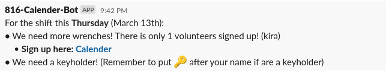
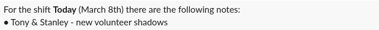

# 816 Calender Slack Bot

## Types of Messages
- Warning
    - Warns if the shift does not enough volunteers.
    - Warns if the shift does not have a keyholder
        - keyholders can desigate themselves on the calendar by putting '🔑' or 'keyholder' after their name
    - 
- Notes
  - Sends any notes left in calender for the shift
  - These notes must have a NON-GRAY background and volunteers signing up for shifts should use a gray/white background to avoid being counted as a note for the shift
  - 

## Configuartion
This bot was built to be as flexible as possilbe to allow for easy changes to be made for if example
a new shift day is added or the frequency of messages needs to be adjusted. The bot can be configured
by modifying the values in the file `config.py`

The following is a list of config variables that can be changed and thier description:
- SHEET_ID: id of the google sheet being used as a signup sheet
    - Can be found in the url: https://docs.google.com/spreadsheets/d/{SHEET_ID}/ 
- KEYHOLDER_MARKS: List of strings users can put after their name to indicate they are a keyholder 
SHIFT_DAYS: List of days of the week the shop is open
    - Case sensitive. First letter should be capitalized. Ex: Monday
- SHIFT_DAY_TO_CHANNEL: Map of the shift days to which channel the message should be posted in
    - The keys of SHIFT_DAY_TO_CHANNEL be equal to SHIFT_DAYS
- SHIFT_VOLUNTEER_WARNING_DAYS: List of ints that represent how many days out the warning message 
should be sent ahead of the shift
    - Example: [6, 3, 0] means the warning message will be sent 6 days, 3 days, and the day of the shift
    (Assuming there are not enough volunteers or there is not a keyholder)
    - This message can be disabled by setting the value to [] (empty list)
- SHIFT_SPECIAL_NOTES_DAYS: List of ints that represent how many days out the notes message 
should be sent ahead of the shift
    - Example: [6, 3, 0] means the notes message will be sent 6 days, 3 days, and the day of the shift
    (Assuming that there are any notes for the shift)
    - In my opinion, this should be just [0]
    - This message can be disabled by setting the value to [] (empty list)
- VOLUNTEER_THRESHOLD: Minimum number of volunteers needed for a shift. Any less will cause the warning message to be sent

## Authentication
Two keys are needed for this bot to work. They need to be set as environment variables.

1. Google API Key
    - Environment variable name: `google_api_key`
    - See https://handsondataviz.org/google-sheets-api-key.html for a description of how to get one
    - It should be completely free but you will need a google cloud account
2. Slack OAuth Bot Token
    - Environment variable name: `slack_token`
    - Can create a bot (and token) by going to https://api.slack.com/apps and creating an app and adding it to slack

## Future Improvements
Below is a list of things it might be nice to implement

- Slack group of keyholders that want to be @'ed (notified) when a shift is missing a keyholder